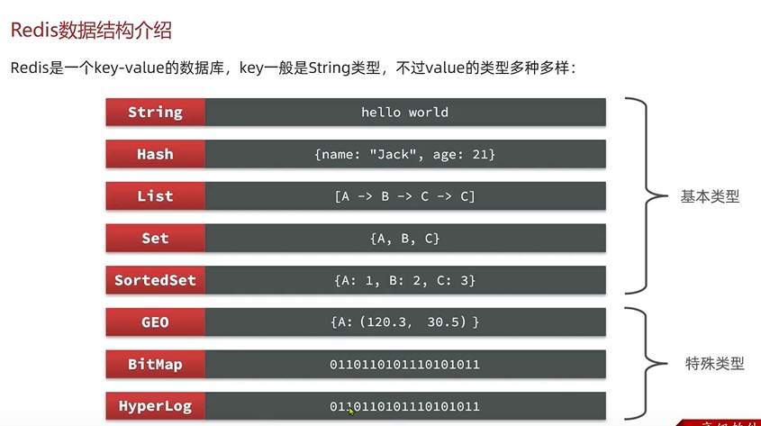
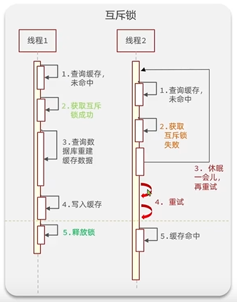
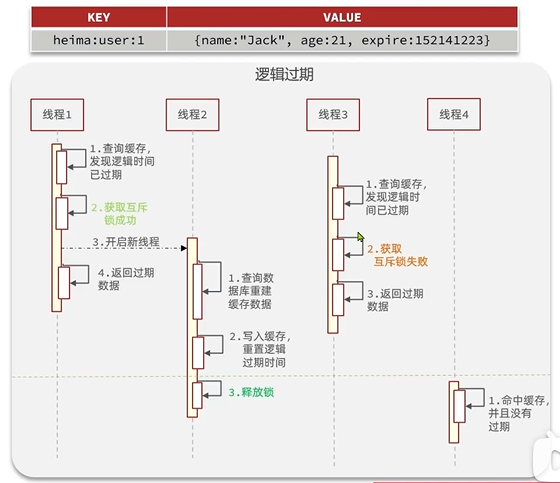
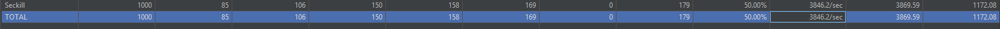

# Redis

## 安装
docker 安装
```
-- docker-compose.yml
services:
  redis:
    image: redis:latest
    container_name: redis
    restart: always
    ports:
      - "6379:6379"
    volumes:
      - ./data:/data
      - ./conf:/usr/local/etc/redis
    command: redis-server /usr/local/etc/redis/redis.conf --appendonly yes --requirepass 123456
```

download redis.conf
```
 wget https://raw.githubusercontent.com/redis/redis/7.2/redis.conf -O ./conf/redis.conf
```
修改redis.conf, 修改log文件
```
logfile "redis.log"
```
运行redis

```
docker compose up -d
```
关闭redis
```
docker compose down
```

进入redis
```
docker exec -it redis redis-cli -a 123456

ping //pong should be returned
```


## 通用命令
查询
```
help @generic
```

### KEYS: 查看符合模板的所有key
```
127.0.0.1:6379> help keys

  KEYS pattern
  summary: Returns all key names that match a pattern.
  since: 1.0.0
  group: generic

```
https://redis.io/docs/latest/commands/keys/

```
h?llo matches hello, hallo and hxllo
h*llo matches hllo and heeeello
h[ae]llo matches hello and hallo, but not hillo
h[^e]llo matches hallo, hbllo, ... but not hello
h[a-b]llo matches hallo and hbllo
```
example
```
127.0.0.1:6379> KEYS *
(empty array)
```

### DEL: 删除一个或多个指定的key
```
127.0.0.1:6379> MSET k1 v1 k2 v2 k3 v3
OK
127.0.0.1:6379> KEYS *
1) "k3"
2) "k2"
3) "k1"
127.0.0.1:6379> DEL k1 k2 k3 k4
(integer) 3
```

### EXISTS: 判断一个或多个KEY是否存在
```
127.0.0.1:6379> SET k1 v1
OK
127.0.0.1:6379> EXISTS k1
(integer) 1
```
### EXPIRE 设置一个KEY的有效期 | TTL 查看Key的剩余日期
```

  EXPIRE key seconds [NX|XX|GT|LT]
  summary: Sets the expiration time of a key in seconds.
  since: 1.0.0
  group: generic
```

```
127.0.0.1:6379> expire k1 20
(integer) 1
127.0.0.1:6379> TTL k1
(integer) 16
127.0.0.1:6379> TTL k1
(integer) 15
127.0.0.1:6379> TTL k1
(integer) 14
127.0.0.1:6379> TTL k1
(integer) 13
127.0.0.1:6379> TTL k1
(integer) 12
127.0.0.1:6379> EXISTS k1
(integer) 0
127.0.0.1:6379> TTL k1
(integer) -2   //代表过期

127.0.0.1:6379> SET age 18
OK
127.0.0.1:6379> TTL age
(integer) -1  //如果没设过期时间，TTL -1 表示永久有效
```
## Redis数据结构



### String类型
根据字符串格式不同，可以分为3类

* string：普通字符串

* 整数类型，可以做自增，自减操作

* 浮点类型，可以做自增，自减操作
 不管哪种格式，底层都是字节数组形式存储，只不过是编码方式不同。字符串类型的最大空间不能超过512m
https://redis.io/docs/latest/commands/redis-8-6-commands/#string-commands

```
127.0.0.1:6379> SET name Rose // 添加key value
OK
127.0.0.1:6379> GET name //获取key valye
"Rose"
127.0.0.1:6379> SET name Jack // 更新 key value
OK
127.0.0.1:6379> GET name
"Jack"
127.0.0.1:6379> MSET age 18 gender 1 // 设置多个key value
OK
127.0.0.1:6379> GET age
"18"
127.0.0.1:6379> incr age //对整数类型 自增1
(integer) 19
127.0.0.1:6379> get age
"19"
127.0.0.1:6379> incr age
(integer) 20
127.0.0.1:6379> get age
"20"
127.0.0.1:6379> incrby age 2 //自增指定大小 比如增2，相当于运算
(integer) 22
127.0.0.1:6379> get age
"22"
127.0.0.1:6379> setnx name Roger // 只有当key不存在时才会设值
(integer) 0
127.0.0.1:6379> setnx email test@163.com
(integer) 1
127.0.0.1:6379> keys *
1) "name"
2) "age"
3) "email"
4) "gender"
127.0.0.1:6379> set name Lily nx  //和setnx一样
(nil)
127.0.0.1:6379> setex name 10 jack //设置key的过期时间，并且要设值，expires不需要设值
OK
127.0.0.1:6379> ttl name
(integer) 6
127.0.0.1:6379> ttl name
(integer) 5
127.0.0.1:6379> ttl name
(integer) 4
127.0.0.1:6379> ttl name
(integer) 3
127.0.0.1:6379> get name
(nil)
127.0.0.1:6379> ttl name
(integer) -2  //最后这个key过期并被删除了

```

### KEY的层级结构
```
项目名：业务名：类型：id
```
比如：
```
XXX:user:1 '{XXX}'
```
存储某项目用户id为1的 用户信息


### Hash类型
也叫散列，其value是一个无序字典，类似于Java中的HashMap结构
* HSET key field value
* HGET key field
* HMSET
* HMGET
* HGETALL
* HKEYS
* HVALS
* HINCRBY
* HSETNX
```
127.0.0.1:6379> HSET user:1 name lucy
(integer) 1
127.0.0.1:6379> HSET user:1 age 31
(integer) 1
127.0.0.1:6379> HGET user:1 name
"lucy"
127.0.0.1:6379> HGETALL user:1
1) "name"
2) "lucy"
3) "age"
4) "31"
```

### List类型
与Java中的LinkedList类似。可以看做是一个双向链表结构。既可以支持正向检索也可以支持反向检索
特征：
* 有序
* 元素可以重复
* 插入和删除块
* 查询速度一般
  
####常见命令 https://redis.io/docs/latest/commands/redis-8-6-commands/#list-commands
* LPUSH key element 向列表左侧插入一个或多个元素
* LPOP key 移除并返回列表左侧的第一个元素，没有则返回nil
* RPUSH key element 右侧插入一个或多个元素
* RPOP key: 移除右侧并返回列表
* LRANGE key star end 返回一段范围内的所有元素
* BLPOP和BRPOP， 和LPOP，RPOP类似，多一个BLocking，没有元素会等待阻塞指定时间

### Set类型
* SADD key member 向set 中添加一个或多个元素
* SREM key member 移除set中的指定元素
* SCARD key 返回set中元素个数
* SISMEMBER key member 判断一个元素是否存在与set中
* SMEMBERS key 获取set中所有的元素
* SINTER key1 key2 求key1与key2的交集
* SDIFF key1 key2 求key1与key2的差集
* SUNION key1 key2 求key1 与 key2的并集

练习：
```shell
## 将下列数据用Redis的Set集合来存储：
# 张三的好友有：李四，王五，赵六
127.0.0.1:6379> sadd zhangsan lisi wangwu zhaoliu
(integer) 3
# 李四的好友有：王五，麻子，二狗
127.0.0.1:6379> sadd lisi wangwu mazi ergou
(integer) 3
# 利用set命令实现下列功能
# 计算张三好友有几人
127.0.0.1:6379> scard zhangsan
(integer) 3
# 计算张三和李四有哪些共同好友
127.0.0.1:6379> sinter zhangsan lisi
1) "wangwu"
# 查询哪些人是张三的好友却不是李四的好友
127.0.0.1:6379> sdiff zhangsan lisi
1) "zhaoliu"
2) "lisi"
# 查询张三和李四的好友总共有那些人
127.0.0.1:6379> sunion zhangsan lisi
1) "mazi"
2) "wangwu"
3) "ergou"
4) "zhaoliu"
5) "lisi"
# 判断李四是否是张三的好友
127.0.0.1:6379> sismember zhangsan lisi
(integer) 1
# 判断张三是否是李四的好友
127.0.0.1:6379> sismember lisi zhangsan
(integer) 0
# 将李四从张三的好友列表中移除
127.0.0.1:6379> srem zhangsan lisi
(integer) 1
127.0.0.1:6379> smembers zhangsan
1) "wangwu"
2) "zhaoliu"
```
## SortedSet类型
每个元素带有一个score属性，基于score属性对元素排序，底层的实现是一个跳表加hash表。
* 可排序
* 不重复元素
* 查询速度快
可以实现排行榜这样的功能

* ZADD key score memeber 添加， 如果已有就更新score值
* ZREM key memeber 删除
* ZSCORE key memeber 获取指定元素的core值
* ZRANK key memeber 获取指定元素的排名，默认从0开始
* ZCARD key 获取元素个数
* ZCOUNT key min max 统计score值在给定范围内的所有元素的个数
* ZINCRBY key increment member 让指定元素自增，补偿为指定的increment
* ZRANGE key min max 按照score排序后，获取指定排名范围内的元素
* ZRANGEBYSCORE key min max 按照score排序后 获取指定score范围内的元素
* ZDIFF ZINTER ZUNION 差集 交集并集
注意 默认排名都是升序，降序则在命令的Z后面添加REV即可

 练习：
 ```shell
# 将班级的下列学生得分存入Redis的SortedSetzhong:
# Jack 85, lucy 89, Rose 82, Tom 95, Jerry 78, Amy 92, Miles 76
127.0.0.1:6379> zadd stus 85 Jack 89 Lucy 82 Rose 95 Tom 78 Jerry 92 Amy 76 Miles
(integer) 7
# 删除Tom
127.0.0.1:6379> zrem stus Tom
(integer) 1
# 获取Amy的分数
127.0.0.1:6379> zscore stus Amy
"92"
# 获取Rose的排名
127.0.0.1:6379> zrevrank stus Rose
(integer) 3
# 查询80分以下有几个
127.0.0.1:6379> zcount stus 0 80
(integer) 2
# 给Amy同学加2分
127.0.0.1:6379> zincrby stus 2 Amy
"94"
# 查出成绩前三名的同学
127.0.0.1:6379> zrevrange stus 0 2
1) "Amy"
2) "Lucy"
3) "Jack"
# 查出成绩80分以下的所有同学
127.0.0.1:6379> zrangebyscore stus 0 80
1) "Miles"
2) "Jerry"
 ```


## Spring Data Redis
Maven
```
<dependency>
    <groupId>org.springframework.boot</groupId>
    <artifactId>spring-boot-starter-data-redis</artifactId>
</dependency>

<!-- 连接池依赖（必须加，否则会报连接不足） -->
<dependency>
    <groupId>org.apache.commons</groupId>
    <artifactId>commons-pool2</artifactId>
    <version>2.12.0</version>
</dependency>
```
application.yml

```
spring:
  data:
    redis:
      host: 127.0.0.1
      port: 6379
      password: 123456  # 你的 Redis 密码
      lettuce:
        pool:
          max-active: 8
          max-idle: 8
```
创建Serializer
```
package org.example.authserver.serializer;

import com.alibaba.fastjson2.JSON;
import com.alibaba.fastjson2.JSONReader;
import com.alibaba.fastjson2.JSONWriter;
import org.springframework.data.redis.serializer.RedisSerializer;
import org.springframework.data.redis.serializer.SerializationException;

import java.nio.charset.Charset;
import java.nio.charset.StandardCharsets;

public class FastJsonRedisSerializer<T> implements RedisSerializer<T> {
    public static final Charset DEFAULT_CHARSET = StandardCharsets.UTF_8;
    private final Class<T> clazz;

    public FastJsonRedisSerializer(Class<T> clazz) {
        this.clazz = clazz;
    }

    @Override
    public byte[] serialize(T t) throws SerializationException {
        if (t == null) {
            return new byte[0];
        }
        return JSON.toJSONString(t, JSONWriter.Feature.WriteClassName).getBytes(DEFAULT_CHARSET);
    }

    @Override
    public T deserialize(byte[] bytes) throws SerializationException {
        if (bytes == null || bytes.length == 0) {
            return null;
        }
        String str = new String(bytes, DEFAULT_CHARSET);
        return JSON.parseObject(str, clazz, JSONReader.Feature.SupportAutoType);
    }
}

```
配置Serilaizer
```
@Configuration
public class RedisConfig {

    @Bean
    public RedisTemplate<String, Object> redisTemplate(RedisConnectionFactory factory) {
        RedisTemplate<String, Object> template = new RedisTemplate<>();
        template.setConnectionFactory(factory);

        StringRedisSerializer stringSerializer = new StringRedisSerializer();
        template.setKeySerializer(stringSerializer);
        template.setHashKeySerializer(stringSerializer);

        FastJsonRedisSerializer<User> fastSerializer = new FastJsonRedisSerializer<>(User.class);
        template.setValueSerializer(fastSerializer);
        template.setHashValueSerializer(fastSerializer);

        template.afterPropertiesSet();
        return template;
    }
}
```

# 缓存更新策略

* 内存淘汰 redis自己有内存淘汰机制，内存不足时自动淘汰部分数据
* 超时剔除 设置TTL 到期字段删除
* 主动更新 编写业务逻辑，修改数据的同时，更新缓存

业务场景：
* 低一致性需求：使用内存淘汰机制
* 高一致性需求：主动更新，并以超时剔除作为兜底方案。例如店铺详情查询的缓存
## 主动更新策略
* **Cache Aside Pattern** 由缓存的调用者，在更新数据库的同时更新缓存
* Read/Write Through Pattern 缓存与数据库整合为一个服务，由服务开维护一致性。调用者调用该服务，无需关心缓存一致性问题 
* Write Behind Caching Pattern 调用者只操作缓存，由其他线程异步的将缓存数据持久化到数据库，保证最终一致， 但难以保证一致性和可靠性

操作缓存和数据库有三个问题需要考虑：
1. 删除缓存还是更新缓存？
   * 更新缓存：每次更新数据库都更新缓存
   * 删除缓存：更新数据库时让缓存失效，查询时再更新缓存
2. 如何保证缓存与数据库的操作的同时成功或失败？
   * 单体系统，将缓存与数据库操作放在一个事务
   * 分布式系统，利用TCC等分布式事务
### Cache Aside Pattern

1. 先删缓存，再操作数据库
```
--------                --------
| 线程1 |               | 线程2 |
--------                --------
    |                      |
---------                  |
| 删缓存 |                  |
---------                  |
    |                      |
    |                   ------------------
    |                  | 缓存未命中       |
    |                  | 读数据库, i=10   | 
    |                  -------------------
    |                      |
    |                      |
-----------------          |
| 数据库更新i=20 |          |
-----------------          |
    |                      |
--------------------------------------   
|      最终缓存i=10,数据库i=20         | 
--------------------------------------
```
由于缓存读取较快，数据库读取也快，所以这种情况很有可能发生。

2. 先删数据库，再删缓存
```
---------                    ----------
| 线程1  |                   |  线程2  |
---------                    ----------
    |                             |
    |                             |
---------------                   |
|没有缓存      |                   |
|读数据库 i=10 |                   |
---------------                   |
    |                             |
    |                     ------------------
    |                     |  更新数据库i=20 |
    |                     ------------------
    |                              |
    |                      -----------------
    |                      | 删除缓存       |
    |                      -----------------
    |                              |
-----------------                  |
| 更新缓存为i=10 |                  |
-----------------                  |
    |                              |
---------------------------------------- 
| 数据不一致，缓存为10， 数据库为20       |
----------------------------------------
```
由于缓存操作比数据库操作要快，所以这种情况发生概率很低，但是即使不发生这种事，在线程2更新数据期间，别的线程还是10 还是会发生数据不一致现象

缓存更新策略最佳实现方案：
1. 低一致性需求：使用内存淘汰机制
2. 高一致性需求：主动更新，并以超时剔除作为兜底方案。
   * 读操作： 缓存命中则直接返回，缓存未命中则查询数据库，并写入缓存，设定超时时间
   * 写操作：先写数据库，然后再删除缓存， 要确保数据库与缓存操作的原子性，数据库更新完，缓存一定要删除，所以要么都成功要么都失败
  
## 缓存穿透
数据在缓存中和数据库都不存在，这样缓存永远不会生效，永远打到数据库中
比如查询店铺，传入一个不存在的店铺id，缓存和数据库都不存在
* **缓存空对象**，将key为不存在店铺的id,值为空对象 存在缓存中，加短期TTL自动清除，可能存在短期不一致，额外内存消耗，当然也可以在新增数据的时候 存入缓存
* 布隆过滤器
* 数据校验

## 缓存雪崩
同一时段大量缓存key同时失效或者Redis服务宕机，导致大量请求到达数据库， 解决方案：
* 给不同key 的TTL加随机值
* 搭建高可用的Redis集群
* 给缓存业务添加降流策略
* 给业务添加多级缓存，使用本地缓存Caffeine，Nignx缓存等等

## 缓存击穿
热点key问题，一个被高并发访问并且缓存重建业务复杂的key突然失效了，无数请求访问在瞬间给数据库带来巨大冲击。
解决方案：
* 互斥锁， 生成缓存过程中加锁，未拿到锁的线程等待知道所释放并于缓存位置
* 逻辑过期，不是真的过期，不设置TTL，在Model上加过期字段expire，具体流程是

### 互斥锁


优点：
*简单
*没有内存空间消耗
*数据高一致性
缺点: 
* 一直在循环等待，性能低，满足不了高可用
* 因为有互斥锁，所以有死锁风险

### 逻辑过期

优点：
* 性能高

缺点：
* 数据不一致，因为过期数据还是返回给用户了
* 有额外内存消耗
* 实现复杂

# 优惠券秒杀
## 全局ID生成
* 唯一性
* 高可用
* 高性能
* 递增性
* 安全性

结合时间错和redis自增数字功能 实现long类型的订单号


```

0 - 00000000 00000000 00000000 00000000 - 00000000 00000000 00000000 00000000
```
从左往右
1： 符号位永远为0
31 位： 以秒位单位，可以使用69年
32 位：秒内的计数器，支持每秒产生2^32个不同ID

# 库存超卖问题
多线程并发请求下单，扣减库存，同时有好几个线程获得相同

解决方法
* 乐观锁：
在SQL语句 where 中判断优惠券库存是否大于等于扣减数量， 将优惠券缓存时间缩短 解决最后还剩最后一张票但是卖不出去问题

```
update tb_voucher set stock = stock - #{count} where id = #{id} and stock >= #{count}
```

* 分段锁，将优惠券放在多个优惠券表中

# 分布式锁
多进程执行同一段任务或者访问同一种资源时需要分布式锁

## 初级分布式锁，redis set key value nx ex 超时锁 + lua脚本 解锁
加锁
```java
// 用UUID+线程Id的方式生成锁的值
 public boolean tryLock(String key, long timeoutInSeconds) {
        String lockValue = getLockValue();
        lockKeyThreadLocal.set(lockValue);
        Boolean result = stringRedisTemplate.opsForValue().setIfAbsent("lock:" + key, lockKeyThreadLocal.get(), timeoutInSeconds, TimeUnit.MINUTES);
        return Boolean.TRUE.equals(result);
    }
```
解锁，先判断锁是不是还是被当前线程持有，也就是检查锁的值是否是threadLocal中的， lua脚本是为了保证原子性
```lua

local key = KEYS[1]
local value = ARGV[1]

local lockValue = redis.call("get", key)

if value == lockValue then
    return redis.call("del", key)
end
return 0
```

```java
public void unlock(String key){
    try {
        stringRedisTemplate.execute(redisUnlockScript, List.of("lock:" + key), lockKeyThreadLocal.get());
    } finally {
        lockKeyThreadLocal.remove();
    }
}
```

但还是存在一些值得改进的地方，比如：
* 超时释放锁的问题，如果有时候业务确实执行的太长，提前释放了锁会导致别的线程拿到了锁，破坏了数据一致性
* 主从一致性，如果redis是主从集群，存在延迟，主从同步延迟，当主节点宕机，锁已经被删，从节点数据还在
* 不可重入
* 不可重试

## Redission
### Redission分布式锁
使用分布式锁
maven 引用
```xml
<dependency>
    <groupId>org.redisson</groupId>
    <artifactId>redisson</artifactId>
    <version>4.3.1</version>
</dependency>
```
Configuration 类
```java
@Configuration
public class RedissionConfig {

    @Bean
    public RedissonClient redissonClient() {
        //创建config
        Config config = new Config().setPassword("123456");
        config.useSingleServer().setAddress("redis://127.0.0.1:6379");
        return Redisson.create(config);
    }
}
```
使用
```java
RLock lock = redissonClient.getLock("lock:voucher-order:" + userId);
    if (lock.tryLock()) {
        try{

        } finally {
            lock.unlock();
        }
    }
```

### Redission可重入锁

Redission为了支持可重入锁，redis 锁的value的数据结构为hash结构 = field (key) : 锁进入的数值(value)。
* 加锁原理和ReetrantLock类似，获取锁时，先看有没有有人持有锁，如果有，看一下当前持有锁的线程是不是自己，如果是，锁计数+1， 重设有效期。
* 解锁原理：先判断当前锁的持有者是不是自己，即key的值是不是自己，是锁计数-1，如果此时锁计数已经是0，则删除锁，如果不是则继续重置有效期。

### Redission 可重试锁
* 如果在tryLock中传入waitTime 和leaseTime，不传默认都是-1
```java
// RedissionLock.java
    @Override
    public RFuture<Boolean> tryLockAsync(long threadId) {
        return getServiceManager().execute(() -> tryAcquireOnceAsync(-1, -1, null, threadId));
    }

```
不传time的话，获取锁失败则直接返回false 不会重试.
* 如果传入值，则会启动看门狗watchdog机制, 每个一段wait/3 time时间重新尝试获取锁

### Redission 多重锁
为了解决主从一致性问题，可以搭建Redis集群即三个节点都是master， redission在set锁时，要在这个三个节点上都set成功才算成功，使用MultiLock
Configuration类
```java
@Configuration
public class RedissionConfig {

    @Bean
    public RedissonClient redissonClient() {
        //创建config
        Config config = new Config().setPassword("123456");
        config.useSingleServer().setAddress("redis://127.0.0.1:6379");
        return Redisson.create(config);
    }

    @Bean
    public RedissonClient redissonClient2() {
        //创建config
        Config config = new Config().setPassword("123456");
        config.useSingleServer().setAddress("redis://127.0.0.1:6380");
        return Redisson.create(config);
    }

    @Bean
    public RedissonClient redissonClient3() {
        //创建config
        Config config = new Config().setPassword("123456");
        config.useSingleServer().setAddress("redis://127.0.0.1:6381");
        return Redisson.create(config);
    }
}
```

java使用
```java
RLock lock1 = redissonClient.getLock("lock:voucher-order:" + userId);
RLock lock2 = redissonClient2.getLock("lock:voucher-order:" + userId);
RLock lock3 = redissonClient3.getLock("lock:voucher-order:" + userId);

RLock lock = redissonClient.getMultiLock(lock1, lock2, lock3);
if (lock.tryLock()) {
        try{

        } finally {
            lock.unlock();
        }
    }
```

# 秒杀优化
之前
``` 
  开始
   |
 判断库存 <从数据库从读取>
   | 
 获取订单 <从数据库中读取>
   |
判断一人一单 
   |
生成订单
   |
插入数据库
   |
返回订单id
```

优化： 使用Redis + lua脚本 将库存存入redis中，对于订单，将每个优惠券已经购买的用户id也存入redis中，这样对于前两个比较耗时的步骤就可以直接使用redis 读取，另外采用异步线程，先生成订单id返回给用，再去执行和数据库打交道比较耗时的插入数据操作， 用户在这个时候已经可以拿着订单id去付款了

```
             开始
              |
              |
              |
 ------------------------
 | redis lua脚本         |
 | 获取库存, 判断库存     |
 | 获取已下单的userId集合 |
 | 判断是否有当前userId  
  |
 |------------------------
             |
             | 结果为0
  ------------------------
  |    创建订单id         |
  ------------------------
             | 
             |
             |
    ------------------------
  |    创建订单id           |
  ------------------------           
             |     | ------------------------------------------ |
             | --- |开启新线程，真的减库存，执行数据库新增数据      |
             |     |--------------------------------------------|
   ------------------------
   |   返回订单Id          |
   ------------------------
```

Lua 脚本
```lua
---
--- Generated by EmmyLua(https://github.com/EmmyLua)
--- Created by limin.
--- DateTime: 2026/6/1 18:07
---

local voucherId = ARGV[1]
local userId = ARGV[2]

local stockKey = "voucher:stock:" .. voucherId

local orderKey = "order:voucher:" .. voucherId


local currentStock = redis.call("get", stockKey)

if tonumber(currentStock) <= 0 then
    return 1
end

if redis.call("sismember", orderKey, userId ) == 1 then
    return 2
end

redis.call("incrby", stockKey, -1) //减库存
redis.call("sadd", orderKey, userId) // 增加userId, 防止重复下单
return 0
```

java优化，整个流程非常简单直接就是执行redis脚本，redis的并发量单机可达10w/QPS， 所以处理这些lua脚本非常快，而且复杂耗时的真实减库存和下订单操作交由异步处理（开启新线程，把这些交由Kafka处理）所以极大提高了秒杀的QPS

```java
public Long createOrder(Long voucherId, int count, BigDecimal payAmount) {
        LoginUser loginUser = userUtil.getCurrentUser();
        // 执行脚本
        Long result = stringRedisTemplate.execute(redisSecKillScript, Collections.emptyList(), voucherId.toString(), loginUser.getUserId().toString());
        if (result == 1) {
            throw new RuntimeException("没库存了");
        } else if (result == 2) {
            throw new RuntimeException("不能重复下单");
        } else if (result != 0) {
            throw new RuntimeException("Lua脚本出错");
        }
        //生成订单id
        Long orderId = redisIdGenerator.generateId("Voucher");

    
        //阻塞队列
        // 或者发通知
        return orderId;
```

## 压测 Jmeter
从官网下载Jmeter按照包zip 解压
从bin文件中找到jmeter.bat 点击，则UI会打开
新建线程组，选择线程数量，填准备好的数据大小，比如我准备了1000个token,这里就写1000 代表有1000个用户，ramp up选0 表示立马就让1000个线程同时发请求，勾掉Same user on each iteration
新建http request，配置秒杀的请求
新建csv data config, 将准备好的token csv, head上有token字符，下面每一行都是一个token
新建http head manager， 配置token参数：key Authriozation, value Bearer ${token}
在http request那新建一个View Results Tree, 这样就能看到请求结果了
同样的地方 新建一个Aggregate Report， 这就是压测的具体报告，其中Throughput就是QPS了

经过测试可以看到QPS为3846


## 通过阻塞队列和线程池 实现异步下单
为了让下单的后续操作快速执行，先用阻塞队列和线程池实现异步下单

```java
private BlockingQueue<VoucherOder> voucherOrderQueue = new ArrayBlockingQueue<>(1024*1024);

private ExecutorService executorService = Executors.newSingleThreadExecutor();

@Lazy
@Autowired
private VoucherOrderService self;

@PostConstruct
public void init() {
    executorService.submit(new VoucherOrderHandler());
}

private class VoucherOrderHandler implements Runnable {

    @Override
    public void run() {
        while (true) {
            try {
                VoucherOder voucherOder = voucherOrderQueue.take(); //注意使用take方法，使得获取不到会阻塞当前线程，用poll 方法就不会
                self.handleVoucherOrder(voucherOder);
            } catch (Exception e) {
                System.out.println(e.getMessage());
                // 给redis中的库存加1，删除redis中优惠券对应的userId
            }
        }
    }
}

@Override
    public Long createOrder(Long voucherId, int count, BigDecimal payAmount) {
        LoginUser loginUser = userUtil.getCurrentUser();
        // 执行脚本
        Long result = stringRedisTemplate.execute(redisSecKillScript, Collections.emptyList(), voucherId.toString(), loginUser.getUserId().toString());
        if (result == 1) {
            throw new RuntimeException("优惠券已领完");
        } else if (result == 2) {
            throw new RuntimeException("不能重复下单");
        } else if (result != 0) {
            throw new RuntimeException("结果返回异常");
        }
        //生成订单id
        Long orderId = redisIdGenerator.generateId("Voucher");
        VoucherOder voucherOder = new VoucherOder();
        voucherOder.setId(orderId);
        voucherOder.setVoucherId(voucherId);
        voucherOder.setUserId(loginUser.getUserId());
        voucherOder.setStatus(1);
        voucherOder.setPayAmount(payAmount);

        voucherOrderQueue.add(voucherOder); // 用阻塞队列实现异步下单，add方法是如果入队失败则跑异常，offer方法是如果入队失败会返回false不会抛异常
    
        return orderId;
    }

@Transactional
@Override
public void handleVoucherOrder(VoucherOder voucherOder) { //因为前面使用lua脚本已经保证一人一单，不会超卖，这里就直接下单，不适用分布式锁了，并且使用压测也证明了没有超卖
    voucherService.deductStock(voucherOder.getVoucherId(), 1);
    voucherOrderMapper.insertVoucherOrder(voucherOder);
}
```

# Redis消息队列

阻塞队列有以下限制：
* 受限于JVM大小，阻塞队列大小不能设太大
* 在相同JVM下操作数据库，会影响IO和CPU使用效率，使得秒杀QPS下降
* 要保持服务一直在线，如果服务down了，数据就丢失了

使用消息队列的好处：
* 消息队列是单独的进程，不受限于原有API service的JVM 影响，不影响QPS
* 消息队列有消息持久化功能，即使消息队列中间件down了，消息还在
* 消息队列有确认消息的功能，保证消息一定会被消费者消费，不会丢失

在Redis中消息队列的实现有以下几种方式：
* 基于List
* 基于PubSub
* 基于Stream 单消费者模式
* 基于Stream 消费者组模式

## 基于List
使用BRPOP或者BLPOP来实现阻塞效果
优点：
* 消息有序性
缺点：
* 不能满足一个消息多个消费者消费的模式
  
## PubSub 发布订阅
消费者可以订阅一个或多个channel，生产者向channel发送消息，所有订阅者都能收到消息

* subscribe channel
* publish channel msg
* psubscribe pattern：订阅与pattern格式所匹配的所有channel （？一个，* 零个或多个，[] 必须是括号内的)

优点：
* 采用发布订阅
缺点：
* 不支持数据持久化
* 无法避免消息丢失
* 消息堆积有上限，超出时数据丢失

## Stream消息队列

### 单消费模式
* XADD 发送消息  XADD 队列名称 * field value
* XLEN 消息队列中有多少消息  XLEN 队列名称
* XREAD 读取消息 XREAD COUNT 读几条 BLOCK 0 STREAMS 消息队列名称 field 
* DEL 删除队列， del命令本身可以删除任何key

  
优点：
* 可回溯，不丢失
* 一个消息可以被多个消费者读取
* 可以阻塞读取

缺点：
* 有消息漏读风险

### 消费者组
将多个消费者划分到一个组中，监听同一个队列

* 消息分流，队列中的消息会分流给组内的不同消费者，加快消息处理速度
* 消息标示， 消费者组会维护一个标示，记录最后一个被处理的消息，如果消息者当即重启，还会从标示之后读取消息。确保每个消息都会被消费
* 消息确认， 消费者获取消息后，消息处于pending状态，并存入pending-list, 处理完，需要XACK来确认消息，编辑消息为已处理，才会从pending-list中移除

* 生产者创建消息：  
```
XGROUP CREATE 队列名称 groupName ID [MKSTREAM]
```
ID： 起始ID表示，$代表最后一个消息，0表示队列中第一个消息

MKSTREAM：队列不存在时自己动创建队列

* 消费者读取消息：
```
XREADGROUP GROUP 组名 消费者名称 [count] [block millisec] [noack] STREAMS key id
```
key: 队列名称
id: 获取消息的起始ID： > 从下一个未消费的消息开始；其他 根据id从pending-list中获取已消费但未确认的消息，例如0， 是从pending-list的第一个消息开始  

步骤：
1. XGROUP CREATE 创建队列和组
2. 用XGROUP CREATE 创建组： xgroup create s1 g1 0
3. 读取消息： xreadgroup group g1 c1 count 1 block 0 streams s1 >
```
127.0.0.1:6379> xreadgroup group g1 c1 count 1 block 0 streams s1 >
1) 1) "s1"
   2) 1) 1) "1780379297036-0"
         2) 1) "orderId"
            2) "1"
```
4. 确认消息，如果不确认，此时执行 xreadgroup group g1 c1 count 1 block 0 streams s1 0 还是可以读到，因为消息还在pending-list没有删除，需要发送ACK标记已读，才能删除： 
```
127.0.0.1:6379> xack s1 g1 1780379297036-0
(integer) 1
```

优点：
* 消息可回溯
* 可以多消费者争抢消息，加快消费速度
* 可以阻塞读取
* 没有消息漏读的风险
* 有消息确认机制，保证消息至少被消费一次

#### 实现

```lua
---
--- Generated by EmmyLua(https://github.com/EmmyLua)
--- Created by limin.
--- DateTime: 2026/6/1 18:07
---

local voucherId = ARGV[1]
local userId = ARGV[2]

local orderId = ARGV[3]

local stockKey = "voucher:stock:" .. voucherId

local orderKey = "order:voucher:" .. voucherId


local currentStock = redis.call("get", stockKey)

if tonumber(currentStock) <= 0 then
    return 1
end

if redis.call("sismember", orderKey, userId ) == 1 then
    return 2
end

redis.call("incrby", stockKey, -1)
redis.call("sadd", orderKey, userId)
redis.call("xadd", "stream.orders", "*", "userId", userId, "voucherId", voucherId, "id", orderId) --- 加入队列
return 0
```

```java
private class VoucherOrderHandler implements Runnable {
        private String queueName = "stream.orders";
        private String groupName = "g1";
        @Override
        public void run() {
            while (true) {
                try {
                    // 定时2秒获取最新还没被消费的消息
                    List<@NonNull MapRecord<String, Object, Object>> list = stringRedisTemplate.opsForStream()
                            .read(Consumer.from(groupName, consumerName),
                            StreamReadOptions.empty().count(1).block(Duration.ofSeconds(2)),
                            StreamOffset.create(queueName, ReadOffset.lastConsumed())
                    );
                    if (list == null || list.isEmpty()) {
                        continue;
                    }
                    MapRecord<String, Object, Object> record = list.get(0);
                    Map<Object, Object> values = record.getValue();
                    VoucherOder voucherOder = objectMapper.convertValue(values, VoucherOder.class);
                    voucherOder.setStatus(1);
                    voucherOder.setPayAmount(new BigDecimal(80));
                    self.handleVoucherOrder(voucherOder);
                    stringRedisTemplate.opsForStream().acknowledge(queueName, groupName, record.getId());
                } catch (Exception e) {
                    System.out.println(e.getMessage());
                    //重试
                    // 读取pending-list中的消息
                    handlePendingMessage();
                }
            }
        }

        private void handlePendingMessage() {
            while (true) {
                try {
                    List<@NonNull MapRecord<String, Object, Object>> list = stringRedisTemplate.opsForStream()
                            .read(Consumer.from(groupName, consumerName),
                                    StreamReadOptions.empty().count(1),
                                    StreamOffset.create(queueName, ReadOffset.from("0")));
                    if (list == null || list.isEmpty()) {
                        break;
                    }
                    MapRecord<String, Object, Object> record = list.get(0);
                    Map<Object, Object> values = record.getValue();
                    VoucherOder voucherOder = objectMapper.convertValue(values, VoucherOder.class);
                    self.handleVoucherOrder(voucherOder);
                    stringRedisTemplate.opsForStream().acknowledge(queueName, groupName, record.getId());
                } catch (Exception e) {
                    System.out.println("处理订单异常：" + e.getMessage());
                    try {
                        Thread.sleep(2000);
                    } catch (InterruptedException e1) {
                        e1.printStackTrace();
                    }
                }
            }
        }
```

# 打卡
类似于大众点评类的打卡，关联一个商店，发布图文，用户可以点赞，取消赞，评论等等
需求：
* 实现blog 发送API
* 实现查看blog详情API，并返回当前用户是否已经点赞
```
CREATE TABLE `tb_blog` (
                        `id` BIGINT NOT NULL AUTO_INCREMENT COMMENT '博客ID，主键',
                        `shop_id` BIGINT NOT NULL COMMENT '店铺ID',
                        `title` VARCHAR(255) NOT NULL COMMENT '博客标题',
                        `content` TEXT COMMENT '博客内容',
                        `user_id` BIGINT NOT NULL COMMENT '用户ID（作者）',
                        `tags` VARCHAR(500) DEFAULT NULL COMMENT '标签，多个标签可用逗号分隔',
                        `likes_count` INT DEFAULT 0 COMMENT '点赞数',
                        `comments_count` INT DEFAULT 0 COMMENT '评论数',
                        `user_name` VARCHAR(100) DEFAULT NULL COMMENT '用户名（冗余字段）',
                        `create_time` DATETIME DEFAULT CURRENT_TIMESTAMP COMMENT '创建时间',
                        `update_time` DATETIME DEFAULT CURRENT_TIMESTAMP ON UPDATE CURRENT_TIMESTAMP COMMENT '更新时间',
                        PRIMARY KEY (`id`),
                        KEY `idx_shop_id` (`shop_id`),
                        KEY `idx_user_id` (`user_id`),
                        KEY `idx_create_time` (`create_time`)
) ENGINE=InnoDB DEFAULT CHARSET=utf8mb4 COLLATE=utf8mb4_unicode_ci COMMENT='博客表';
```

实现思路：
这里是简单的实现，不包含图片，因为图片相关的缓存和放置适合与nginx相结合，nginx打算单独开一篇
增删改就不多写了。
值得注意的是： 其中有一处需要用到redis， 就是当某个用户打开一篇打卡日记，要返回当前用户是否已经点赞

* 这就需要用到Redis的Set数据结构，将给一篇打卡笔记点过赞的用户id缓存在redis中，当查询打卡笔记的时候，直接用sismember 查看当前用户id是否在改set集合里

## 点赞
需求：
* 实现一个点赞blog的API，如果已经点过赞，就取消对该blog的点赞
  
实现思路：
* 增加/blog/{id}/like API, 根据传进来的打卡笔记id的redis 点赞用户集合，
* 从redis Set中判断当前用户id是否在里面
* 是，已经点过赞了，取消点赞，更新数据库，在redis集合中取消当前用户id
* 否，更新数据库，在redis集合中加入当前用户id
```
@Data
public class Blog {
    private Long id;
    private Long shopId;
    private String title;
    private String content;
    private Long userId;
    private String tags;
    private int likesCount;
    private int commentsCount;


    private boolean isLike;

    private String userName;

    private LocalDateTime createTime;
    private LocalDateTime updateTime;


}
```


# 关注/取消关注
需求：
* 实现一个API 可以关注或者取消关注某个用户
  
实现思路：
* 增加/follow/{id}/{isFollow} API， 当isFollow是true 关注用户，是false取消用户
* 增加表存放用户之间的follow关系
* 关注就增加一条数据
* 取消关注就删除一条数据
```
CREATE TABLE `tb_follow` (
        `id` bigint(20) auto_increment NOT NULL COMMENT '主键',
        `user_id` bigint(20) unsigned NOT NULL COMMENT '用户id',
        `follow_user_id` bigint(20) unsigned NOT NULL COMMENT '关联的用户id',
        `create_time` timestamp NOT NULL DEFAULT CURRENT_TIMESTAMP COMMENT '创建时间',
        PRIMARY KEY (`id`)
) ENGINE=InnoDB DEFAULT CHARSET=utf8mb4;
```
## 是否关注 
需求：
* 实现一个API，快速知道当前用户是否关注了某个用户

实现思路：
* 要想快速知道，必须得用到redis
* 增加一个/follow/is/not/{id} API
* 改造之前得关注逻辑，当插入一条关注数据后，就在redis的follow:<userId> key的Set集合中增加一个被关注的用户id
```java
    stringRedisTemplate.opsForSet().add(FOLLOWED_KEY + loginUser.getUserId(), followUserId.toString());

```
* 同理，取消关注，就是删除一条被关注的用户id
```java
    stringRedisTemplate.opsForSet().remove(FOLLOWED_KEY + loginUser.getUserId(), followUserId.toString());

```
* 当查看是否关注了某用户时，通过sismember 命令直接快速知道
```java
stringRedisTemplate.opsForSet().isMember(FOLLOWED_KEY + loginUser.getUserId(), id);
```


## 共同关注
需求：
* 实现一个API，获取当前用户和某个用户直接的共同关注用户

实现思路：
* 利用上面创建的follow:<用户id> Set集合，每个用户都有一个set集合，没关注的除外
* 用SINTER 命令 返回交集（实际开发直接用redisTemplate就行）
```java
        Set<String> intersect = stringRedisTemplate.opsForSet().intersect(userKey, FOLLOWED_KEY + id);

```

# Feed流，投喂流
有两种常见模式：
* Timeline：不做内容筛选，简单按照内容发布时间排序，长用户好友关注，例如朋友圈
* 智能排序：利用只能算法屏蔽掉违规的，用户不感兴趣的内容，推送用户感兴趣的内容

## Timeline
### 拉模式 （读扩撒）：
发的时候先发到发件箱，用户读的时候， 主动拉取发件箱 到自己的收件箱中
*缺点：延迟高，一个用户可能关注了很多人，打开的一瞬间加载时间会长

### 推模式（写模式）:
发的时候直接先发到用户的收件箱
*缺点：内存占用高，如果一个人有多个粉丝，要给每个粉丝都发

### 推拉结合（读写混合）
对于大V而言，有活跃粉丝，有普通用户，当大V发文的时候，给活跃粉丝用推模式，给普通粉丝用拉模式。这种模式 适合过千万的用户量，有大V的系统

## 推模式实战
需求：
* 当用户发了一篇打卡笔记时，要将笔记推送给用户粉丝

实现思路：
* 改进之前的打卡API： POST /blog, 当在数据库插入成功blog时，通过数据库检索当前用户的粉丝
* 把该篇blog id 推个每个粉丝，循环粉丝set结合，用redis 把 blog id 放在 key 为feed:blog:<userId>的set集合中：
```java
List<Long> userIds = followMapper.getAllUserId(loginUser.getUserId());
userIds.forEach(userId -> {
            stringRedisTemplate.opsForZSet().add(BLOG_FEED_KEY + userId, blog.getId().toString(), System.currentTimeMillis());
        });
```
当然推送消息可以更优化，比如用阻塞队列或者消息队列异步处理

## 查看朋友圈
需求：
* 提供一个API，可以查看所有关注的用户最近发的blog

实现思路：
* 实现API /blog/of/follow,返回minTime 最小时间戳 和 offset 与最小值一样的元素个数，下次返回需要带回
* 实现滚动分页，利用redis SortedSet 数据结构，根据score 倒序排序，记录上一次最小的score值实现滚动分页
zrevrangebyscore key max min withscores limit offset count
1. max:第一次查询是当前时间，后面是上一次查询最小值
2. min: 0 固定不变
3. offset: offset是从score为max的值开始的第几个数，第一次是0 即从头开始算， 后面是在上一次结果中，与最小值一样的元素的个数，即与当前max值一样的数有多少相同的，就从多少开始算，因为max是上一页中已经返回了的，下一次不需要再次返回
4. count: 每页多少条，可固定


```java
public ScrollData getFollowBlog(Long minTime, Integer offset, Integer count) {
        Long userId = userUtil.getCurrentUser().getUserId();
        String key = BLOG_FEED_KEY + userId;
//        zrevrangebyscore key max min withscores limit offset count
        Set<ZSetOperations.@NonNull TypedTuple<String>> typedTuples = stringRedisTemplate.opsForZSet().reverseRangeByScoreWithScores(key, 0, minTime, offset, count);
        if (typedTuples == null || typedTuples.isEmpty()) {
            return null;
        }
        List<Blog> blogs = typedTuples.stream().map(blogId -> {
            Blog blog = blogMapper.selectById(Long.valueOf(blogId.getValue()));
            blog.setLike(isBlogLiked(blog.getId(), userId));
            return blog;
        }).toList();
        Double currentMinTimeDouble = typedTuples.parallelStream().map(ZSetOperations.TypedTuple::getScore).min((o1, o2) -> (int) (o1 - o2)).get();
        long currentOffset = typedTuples.parallelStream().filter(t -> Objects.equals(t.getScore(), currentMinTimeDouble)).count();
        ScrollData scrollData = new ScrollData();
        scrollData.setOffset(currentOffset);
        scrollData.setMinTime(currentMinTimeDouble.longValue());
        scrollData.setList(blogs);
        return scrollData;
    }

```
结果验证：
第一次：
```json
{
	"list": [
		{
			"commentsCount": 0,
			"content": "清淡可口，有老家的味道，小朋友配宝宝餐椅",
			"createTime": "2026-06-03T08:32:54",
			"expireTime": null,
			"id": 12,
			"like": false,
			"likesCount": 0,
			"shopId": 4,
			"tags": "亲子, 休闲, 味道好, 好停车",
			"title": "好久没吃的淮扬菜",
			"updateTime": "2026-06-03T08:32:54",
			"userId": 3,
			"userName": "user_2"
		},
		{
			"commentsCount": 0,
			"content": "夏天的第一杯奶茶，霸王别姬奶茶",
			"createTime": "2026-06-03T08:27:19",
			"expireTime": null,
			"id": 11,
			"like": true,
			"likesCount": 1,
			"shopId": 2,
			"tags": "朋友聚会首选, 休闲, 味道好, 好停车",
			"title": "夏天第一杯奶茶",
			"updateTime": "2026-06-03T08:35:08",
			"userId": 6,
			"userName": "user_5"
		},
		{
			"commentsCount": 0,
			"content": "好久没吃火锅了，夏都小镇的这家火锅味道超级好，环境优美，适合朋友聚会",
			"createTime": "2026-06-03T08:26:32",
			"expireTime": null,
			"id": 10,
			"like": false,
			"likesCount": 0,
			"shopId": 1,
			"tags": "朋友聚会首选, 休闲, 味道好, 好停车",
			"title": "地道四川火锅",
			"updateTime": "2026-06-03T08:26:32",
			"userId": 5,
			"userName": "user_4"
		}
	],
	"minTime": 1780475192774,
	"offset": 1
}
```
中间某个关注的用户又发了篇笔记, 可以通过redis查看此时feed:blog:<userId>的set集合有没有变化
此时带上minTime=1780475192774， offset=1， 没有出现重复数据，非常完美
```java
{
	"list": [
		{
			"commentsCount": 0,
			"content": "一直喝喜茶，味道还是一如既往的好，夏天来了，口味更多了",
			"createTime": "2026-06-03T08:25:41",
			"expireTime": null,
			"id": 9,
			"like": false,
			"likesCount": 0,
			"shopId": 6,
			"tags": "亲子, 休闲, 味道好, 好停车",
			"title": "不愧是喜茶",
			"updateTime": "2026-06-03T08:25:41",
			"userId": 4,
			"userName": "user_3"
		},
		{
			"commentsCount": 0,
			"content": "今天带娃开车来这家店打卡，有很多好吃的好玩的，全家非常开心",
			"createTime": "2026-06-03T08:24:41",
			"expireTime": null,
			"id": 8,
			"like": false,
			"likesCount": 0,
			"shopId": 5,
			"tags": "亲子, 休闲, 味道好, 好停车",
			"title": "非常好吃的一家店",
			"updateTime": "2026-06-03T08:24:41",
			"userId": 3,
			"userName": "user_2"
		}
	],
	"minTime": 1780475083264,
	"offset": 1
}
```

# GEO数据结构
*GEOADD 添加坐标，经度longitude, 纬度latitude，值member
*GEODIST 计算两个点直接的距离
*GEOHASH 将指定member坐标转为hash字符串并返回
*GEOPOS 返回member的坐标
*GEORADIUS 指定圆心半径找到圆内所有member, 6.2后已废弃
*GEOSEARCH 在指定范围内搜索member，并按照与指定点之间的距离排序后返回，范围可以是圆形或者矩形 6.2新
*GEOSEARCHSTORE 与GEOSEARCH类似，可以把结果存储到一个指定的key中 6.2新

# 实现附近商户功能
实现一个API /shop/search?x=121.2874&y=31.1779&pageNo=1
x是经度，y是维度，pageNo是查询到第几页，也可以扩展传入范围参数

先用UT 把商品坐标和商铺id导入到redis中：
```java
@Test
    public void loadShopGEOData() {
        List<Shop> shops = shopMapper.findAllShops();

        List<RedisGeoCommands.GeoLocation<String>> locations = new ArrayList<>();
        for (Shop shop : shops) {
            RedisGeoCommands.GeoLocation<String> location = new RedisGeoCommands.GeoLocation<>(shop.getId().toString(), new Point(shop.getX(), shop.getY())); //x 是longitude
            locations.add(location);
        }
        stringRedisTemplate.opsForGeo().add("shop:geo", locations);
    }
```

查询店铺时，从redis中根据传入的x,y 以及范围参数，获取商铺id,再通过商铺id从数据库中查询商铺具体信息，然后带上距离
```java
@Override
    public List<Shop> searchByGEO(Double x, Double y, int pageNo) {
        GeoResults<RedisGeoCommands.GeoLocation<String>> results = stringRedisTemplate.opsForGeo().search(
                "shop:geo",
                GeoReference.fromCoordinate(new Point(x, y)), //中心点坐标
                new Distance(5000), //5000米
                RedisGeoCommands.GeoSearchCommandArgs.newGeoSearchArgs().includeDistance().limit(PAGE_SIZE*3)
        );
        List<GeoResult<RedisGeoCommands.GeoLocation<String>>> content = results.getContent();
        if (content == null || content.isEmpty()) {
            return null;
        }
        int from = (pageNo-1) *  PAGE_SIZE;
        List<Shop> shops = content.stream().skip(from).map(geoResult -> { //geo不支持带分页参数，只能先把所有数据都查出，再逻辑上分页了
            String shopIdStr = geoResult.getContent().getName();
            Distance d istance = geoResult.getDistance();
            Shop shop = shopMapper.getShopById(Long.parseLong(shopIdStr));
            shop.setDistance(distance.getValue());
            return shop;
        }).limit(PAGE_SIZE).toList();
        return shops;
    }
```

# Redis 高级篇
# Redis持久化
## RDB Redis backup file (redis数据备份文件)
把内存中所有数据都记录到磁盘，当redis重启后，从磁盘读取快照文件，恢复数据
快照文件为RDB文件，默认是保存在当前运行目录

### save 主进程执行，阻塞所有命令
redis.conf配置
```conf
# 900秒内，如果至少有1个key被修改，则执行bgsave
save 900 1

# 是否压缩，建议不开启，压缩也会消耗CPU
rdbcompression yes

# RDB文件名称
dbfilename dump.rdb

#文件保存路径目录
dir ./
```

### bgsave 开启子进程RDB
bgsave 开始时会fork主进程得到子进程，子进程共享主进程的内存数据，完成fork后读取内存数据并写入RDB文件，新的RDB文件会替换旧的。
每个进程在操作内存数据是 会被分配一个虚拟内存，虚拟内存有页表，来操作真实的物理内存，子进程就是copy了主进程的页表从达到操作相同数据，而且不影响主进程的。

子进程在读取数据时，主进程用copy-on-write的方法将数据复制一份到内存中 并不会真正去修改子进程正在读的数据。

* RDB会什么时候执行， 默认服务停止时
* 缺点：执行间隔长，有数据丢失的风险， fork子进程，压缩，写出RDB文件都比较耗时

## AOF
Append Only File(追加文件)， 每一个写命令都会记录在AOF文件中，命令日志文件
默认是关闭的，需要修改redis.conf配置文件来开启：
```
appendonly yes
```

# 用docker 搭建 redis的主从集群
docker compose文件
```yaml
services:
  redis-node1:
    image: redis:latest
    container_name: redis-node1
    restart: unless-stopped
    ports:
      - "6379:6379"
    networks:
      - redis-net
    volumes:
      - ./redis-node1-data:/data
      - ./conf/redis-node1.conf:/usr/local/etc/redis/redis.conf
    command: redis-server /usr/local/etc/redis/redis.conf --appendonly yes --requirepass 123456


  redis-node2:
    image: redis:latest
    container_name: redis-node2
    restart: unless-stopped
    ports:
      - "6380:6379"
    networks:
      - redis-net
    volumes:
      - ./redis-node2-data:/data
      - ./conf/redis-node2.conf:/usr/local/etc/redis/redis.conf
    command: redis-server /usr/local/etc/redis/redis.conf --appendonly yes --slaveof redis-node1 6379 --requirepass 123456 --masterauth 123456
    depends_on:
      - redis-node1
      
  redis-node3:
    image: redis:latest
    container_name: redis-node3
    restart: unless-stopped
    ports:
      - "6381:6379"
    networks:
      - redis-net
    volumes:
      - ./redis-node3-data:/data
      - ./conf/redis-node3.conf:/usr/local/etc/redis/redis.conf
    command: redis-server /usr/local/etc/redis/redis.conf --appendonly yes --slaveof redis-node1 6379 --requirepass 123456 --masterauth 123456
    depends_on:
      - redis-node1

  # Redis 哨兵节点 1
  redis-sentinel-1:
    image: redis:latest
    container_name: redis-sentinel-1
    restart: always
    command: redis-sentinel /usr/local/etc/redis/sentinel.conf
    volumes:
      - ./sentinel/sentinel1/:/usr/local/etc/redis/
    ports:
      - "26379:26379"
    networks:
      - redis-net
    depends_on:
      - redis-node1
      - redis-node2
      - redis-node3

  # Redis 哨兵节点 2
  redis-sentinel-2:
    image: redis:latest
    container_name: redis-sentinel-2
    restart: always
    command: redis-sentinel /usr/local/etc/redis/sentinel.conf
    volumes:
      - ./sentinel/sentinel2/:/usr/local/etc/redis/
    ports:
      - "26380:26379"
    networks:
      - redis-net
    depends_on:
      - redis-node1
      - redis-node2
      - redis-node3
 
  # Redis 哨兵节点 3
  redis-sentinel-3:
    image: redis:latest
    container_name: redis-sentinel-3
    restart: always
    command: redis-sentinel /usr/local/etc/redis/sentinel.conf
    volumes:
      - ./sentinel/sentinel3/:/usr/local/etc/redis/
    ports:
      - "26381:26379"
    networks:
      - redis-net
    depends_on:
      - redis-node1
      - redis-node2
      - redis-node3
  
networks:
  redis-net:
    driver: bridge

```

测试：
1. 向redis-node1执行 set foo1 a

```
docker exec -it redis-node1 redis-cli -a 123456 set foo1 a
```
2. 向redis-node2执行 get foo1, 可以看到redis-node2 也能get到foo1 key
```
root@DESKTOP-V6E32S3:/home/limin/services/redis# docker exec -it redis-node2 redis-cli -a 123456 get foo1
Warning: Using a password with '-a' or '-u' option on the command line interface may not be safe.
"a"
```
3. 查看role
```
docker exec redis-sentinel-1 redis-cli -p 26379 SENTINEL GET-MASTER-ADDR-BY-NAME mymaster

```
4. 关掉redis-node1，监视sentinel log,看会不会转移
```
docker logs redis-sentinel-1 -f

ea 4
1:X 04 Jun 2026 14:40:53.634 # +elected-leader master mymaster 172.20.0.2 6379
1:X 04 Jun 2026 14:40:53.634 # +failover-state-select-slave master mymaster 172.20.0.2 6379
1:X 04 Jun 2026 14:40:53.701 # +selected-slave slave 172.20.0.3:6379 172.20.0.3 6379 @ mymaster 172.20.0.2 6379
1:X 04 Jun 2026 14:40:53.701 * +failover-state-send-slaveof-noone slave 172.20.0.3:6379 172.20.0.3 6379 @ mymaster 172.20.0.2 6379
1:X 04 Jun 2026 14:40:53.764 * +failover-state-wait-promotion slave 172.20.0.3:6379 172.20.0.3 6379 @ mymaster 172.20.0.2 6379
1:X 04 Jun 2026 14:40:58.603 # +sdown slave 172.20.0.3:6379 172.20.0.3 6379 @ mymaster 172.20.0.2 6379
1:X 04 Jun 2026 14:40:58.603 # +sdown slave 172.20.0.4:6379 172.20.0.4 6379 @ mymaster 172.20.0.2 6379
1:X 04 Jun 2026 14:41:01.511 * Sentinel new configuration saved on disk
1:X 04 Jun 2026 14:41:01.511 # +promoted-slave slave 172.20.0.3:6379 172.20.0.3 6379 @ mymaster 172.20.0.2 6379
1:X 04 Jun 2026 14:41:01.511 # +failover-state-reconf-slaves master mymaster 172.20.0.2 6379
1:X 04 Jun 2026 14:41:01.511 * +slave-reconf-sent slave 172.20.0.4:6379 172.20.0.4 6379 @ mymaster 172.20.0.2 6379
1:X 04 Jun 2026 14:41:01.511 # -sdown slave 172.20.0.3:6379 172.20.0.3 6379 @ mymaster 172.20.0.2 6379
1:X 04 Jun 2026 14:41:33.537 # +tilt #tilt mode entered
1:X 04 Jun 2026 14:42:03.560 # -tilt #tilt mode exited
1:X 04 Jun 2026 14:42:03.560 # +failover-end-for-timeout master mymaster 172.20.0.2 6379
1:X 04 Jun 2026 14:42:03.560 # +failover-end master mymaster 172.20.0.2 6379
1:X 04 Jun 2026 14:42:03.560 # -sdown slave 172.20.0.4:6379 172.20.0.4 6379 @ mymaster 172.20.0.2 6379
1:X 04 Jun 2026 14:42:03.560 # +switch-master mymaster 172.20.0.2 6379 172.20.0.3 6379
1:X 04 Jun 2026 14:42:03.560 * +slave slave 172.20.0.4:6379 172.20.0.4 6379 @ mymaster 172.20.0.3 6379
1:X 04 Jun 2026 14:42:03.560 * +slave slave 172.20.0.2:6379 172.20.0.2 6379 @ mymaster 172.20.0.3 6379
1:X 04 Jun 2026 14:42:03.562 * Sentinel new configuration saved on disk
1:X 04 Jun 2026 14:42:08.576 # +sdown slave 172.20.0.2:6379 172.20.0.2 6379 @ mymaster 172.20.0.3 6379

```

