# 分布式架构

一个大小应用被拆分成很多小应用分别部署在各个机器

@LoadBalanced注解 实现负载均衡 默认是轮询


# Nacos

## 服务注册
引入
```xml
        <dependency>
            <groupId>com.alibaba.cloud</groupId>
            <artifactId>spring-cloud-starter-alibaba-nacos-discovery</artifactId>
        </dependency>
```
application.yaml配置
```
server:
  port: 8441
  address: 0.0.0.0

spring:
  application:
    name: order

  cloud:
    nacos:
      server-addr: 127.0.0.1:8848
      username: nacos
      password: nacos
      discovery:
        register-enabled: true  # 开启自动注册（默认就是true）
  config:
    import:
      - nacos:order.yaml
```

## 服务发现 
配合@LoadBalanced注解 实现负载均衡 默认是轮询
```xml
        <dependency>
            <groupId>org.springframework.cloud</groupId>
            <artifactId>spring-cloud-starter-loadbalancer</artifactId>
        </dependency>
```
注册中心down了 还能发请求吗

如果调用过，有实例缓存，可以通过
如果没调用过，就不行


## 配置中心

引入
```
        <dependency>
            <groupId>com.alibaba.cloud</groupId>
            <artifactId>spring-cloud-starter-alibaba-nacos-config</artifactId>
        </dependency>
```

无感刷新 @ConfigurationProperties(prefix="")

## 配置监听

```java

@Bean
    public ApplicationRunner applicationRunner(NacosConfigManager nacosConfigManager) {
        return args -> {
            ConfigService configService = nacosConfigManager.getConfigService();
            configService.addListener("order.yaml", "DEFAULT_GROUP", new Listener() {
                @Override
                public Executor getExecutor() {
                    return Executors.newFixedThreadPool(4);
                }

                @Override
                public void receiveConfigInfo(String configInfo) {
                    System.out.println(configInfo);
                    System.out.println("邮件通知");
                }
            });
        };
    }

```

## 思考题
如果nacos配置文件中的key 和 service里的key相同 spring 会读哪一个
- 答案是nacos 生效

## 数据隔离

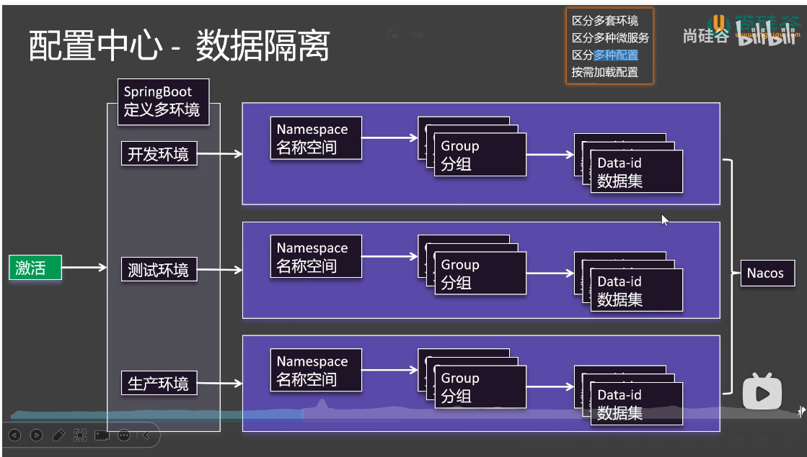

```yaml
spring:
  application:
    name: order

  profiles:
    active: test

  cloud:
    nacos:
      server-addr: 127.0.0.1:8848
      username: nacos
      password: nacos
      discovery:
        register-enabled: true  # 开启自动注册（默认就是true）
      config:
        import-check:
          enabled: false
        namespace: ${spring.profiles.active:dev}
---
spring:
  config:
    import:
      - nacos:common.yaml?group=order
      - nacos:database.yaml?group=order
    activate:
      on-profile: dev


---
spring:
  config:
    import:
      - nacos:common.yaml?group=order
      - nacos:database.yaml?group=order
      - nacos:haha.yaml?group=order
    activate:
      on-profile: test

```

# OpenFeign
依靠注解和接口 实现负载均衡

在主入口加@EnableFeignClients， 然后创建Feign client类， 经过测试负载均衡策略默认也是轮询
```java

@FeignClient("product") // 服务名称
public interface ProductFeignClient {

    @GetMapping("/product/{id}")
    Product getProduct(@PathVariable Long id);
}


```

## 调用第三方API

## 客户端负载均衡 和服务端负载均衡

* 客户端负载均衡： 客户端决定调哪个实例
* 服务端负载均衡：服务端接收请求后决定调哪个实例 比如用nginx

## log显示

## 超时控制
默认readTimeout 是60s
设置

application.yaml
``` yaml
spring:
  profiles:
    include: feign
```
创建application-feign.yaml
```yaml
spring:
    cloud:
        openfeign:
            client:
                config:
                    default:
                        logger-level: full
                        connect-timeout: 1000
                        read-timeout: 2000
                    product:
                        logger-level: full
                        connect-timeout: 3000
                        read-timeout: 5000
```

## 重试策略
默认不重试， spring cloud openfeign会去到application context容器中找一些bean 去创建Feign Client
* Logger.Level
* Retryer
* ErrorDecoder
* Request.Options
* Collection\<RequestInterceptor>
* SetterFactory
* QueryMapEncoder
* Capability

比如配置超时，可以定义一个bean
```java
    @Bean
    public Retryer retryer() {
        return new Retryer.Default();
    }

```

## 拦截器
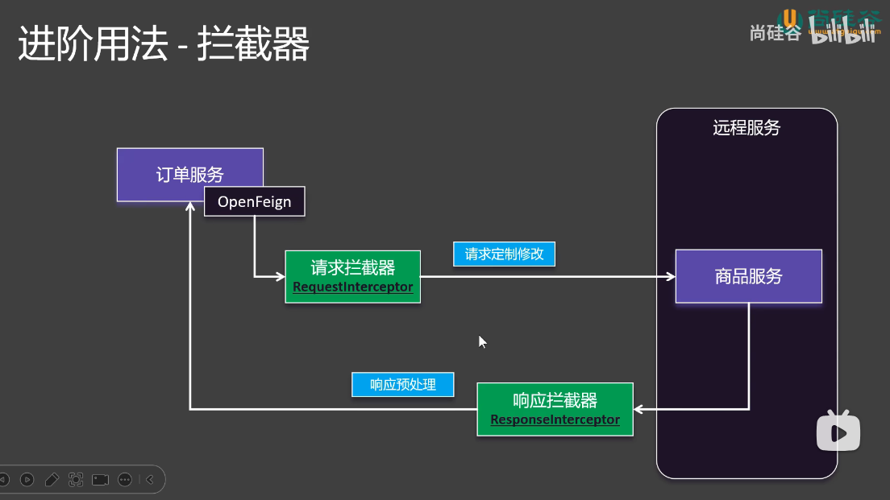
比如每次发请求之前带上一个traceId
openfeign会自动找Collection<RequestInterceptor>， 所以我们配置好RequestInterceptor Bean就可以实现全局拦截
```java
@Component
public class TraceInterceptor implements RequestInterceptor {
    @Override
    public void apply(RequestTemplate template) {
        System.out.println("TraceInterceptor running");
        template.header("X-TraceID", UUID.randomUUID().toString());
    }
}

// 2026-05-20T11:46:06.223+08:00 DEBUG 13776 --- [order] [0.0-8441-exec-2] o.e.order.feign.ProductFeignClient       : [ProductFeignClient#getProduct] ---> GET http://product/product/1 HTTP/1.1
// 2026-05-20T11:46:06.223+08:00 DEBUG 13776 --- [order] [0.0-8441-exec-2] o.e.order.feign.ProductFeignClient       : [ProductFeignClient#getProduct] X-TraceID: 35c66835-efd0-4ff4-8dab-17b2b73f71bf
```

## Fallback：兜底返回
需要整合Sentinel实现

1. 创建一个fallback类实现自定义的FeignClient接口
```java
@Component
public class ProductFeignFallback implements ProductFeignClient {
    @Override
    public Product getProduct(Long id) {
        Product product = new Product();
        product.setId(1L);
        product.setDescription("Fallback Product");
        product.setPrice(new BigDecimal("1000.00"));
        product.setQuantity(0);
        return product;
    }
}
```
2. 引入sentinel
```xml
        <dependency>
            <groupId>com.alibaba.cloud</groupId>
            <artifactId>spring-cloud-starter-alibaba-sentinel</artifactId>
        </dependency>
```

3. 配置FeignClient接口和yaml

```java
@FeignClient(value = "product", fallback =  ProductFeignFallback.class)

```
```yaml
feign:
  sentinel:
    enabled: true
```

# Sentinel

## 资源与规则
* 资源 API web接口,类方法
* 规则：
  1. 流量控制（FlowRule)
  2. 熔断降级（DegradeRule)
  3. 系统保护（SystemRule)
  4. 来源访问控制（AuthorityRule)
  5. 热点参数（ParamFlowRule）

## 基础场景
1. 部署sentinel
docker-compose.yaml
```yaml
services:
  sentinel:
    image: bladex/sentinel-dashboard:1.8.6
    container_name: sentinel
    restart: always
    ports:
      - "8858:8858"
    environment:
      - TZ=Asia/Shanghai
      - SENTINEL_AUTH_USER=sentinel
      - SENTINEL_AUTH_PWD=123456
    volumes:
      - ./sentinel-data:/data
```
docker compose up -d

打开登录 http://localhost:8858 用 sentinel/sentinel

2. 在微服务中连接Sentinel
application.yaml
```
spring:
    cloud:
        sentinel:
            transport:
                dashboard: localhost:8858
            eager: true
```

3. 指定资源
用@SentinelResource注解
```java
    @SentinelResource("createOrder")
    @Override
    public Order create(Long userId, Long productId) {
        Order order = new Order();
        order.setTotalPrice(new BigDecimal("10000.00"));
        order.setUserId(userId);
        order.setAddress("某某小区某号几零几");
        Product product = productFeignClient.getProduct(productId);
        order.setProducts(List.of(product));
        return order;
    }

```
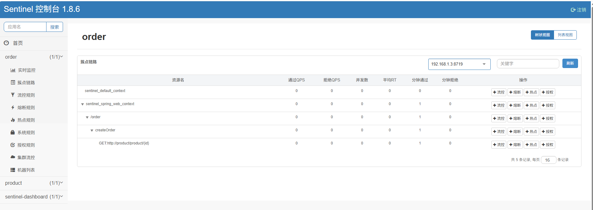

可以设置/create API 的QPS大小
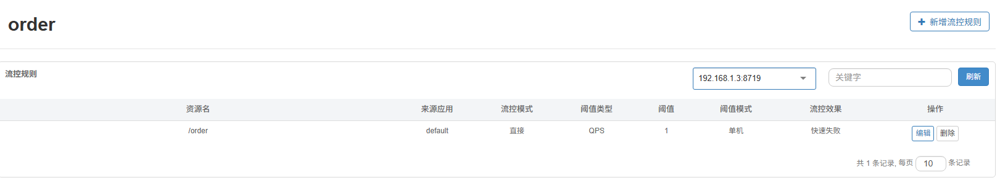
测试：快速用postman发送请求，就会得到： 429（too many requests),Blocked by Sentinel (flow limiting) 错误

## 异常处理
* fallback：处理业务异常（程序报错）
* blockHandler：处理 Sentinel 限流 / 降级 / 热点异常
当遇到限流时，抛出异常，各种resource改如何自定义异常处理
1. Web接口
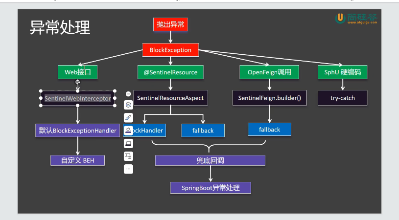

自定义BlockExceptionHandler

2. SentinelResource
> 指定注释里的blockHandler, fallback, defaultFallback

```java
 @SentinelResource(value = "createOrder", blockHandler = "createBlockHandler")
    @Override
    public Order create(Long userId, Long productId) {
        Order order = new Order();
        order.setTotalPrice(new BigDecimal("10000.00"));
        order.setUserId(userId);
        order.setAddress("某某小区某号几零几");
        Product product = productFeignClient.getProduct(productId);
        order.setProducts(List.of(product));
        return order;
    }

    public Order createBlockHandler(Long userId, Long productId, BlockException blockException) {
        Order order = new Order();
        order.setTotalPrice(new BigDecimal("0.00"));
        order.setUserId(0L);
        order.setAddress("create block handler");
        return order;
    }
```
3. OpenFeign
和之前OpenFeign fallback一样，OpenFeign注解支持fallback参数
参考源码SentinelFeignAutoConfiguration

4. SphU.entry

## 流控规则

### 阙值类型

### 流控模式
1. 直连， 指对直接调用某个资源进行限制，比如直接调用/order API
* 快速失败， 超过指定的QPS直接失败
* Warm up， 可以设置某个时间段系统接收最终的QPS
* 匀速排队，超过QPS的请求会排队，一直等到某个特定时间，超时就失败， 对应的是漏桶算法
  
2. 链路， 对某些链路调用资源进行限制，比如限制/order API, 在秒杀链路中限制，对正常下单链路中不限制， 只支持快速失败
3. 关联，将两个或多个资源关联， 比如当读写请求量大的时候，优先放行写的流量，限制读的流量， 只支持快速失败

## 熔断规则
### 作用：
* 及时切断不稳定的调用
* 快速返回，不积压
* 避免雪崩效应
最佳实践： 熔断降级作为保护自身手段，通常在客户端进行配置

### 断路器：
#### 状态
* 闭合：允许调用
* 打开：不允许调用，客户端快速返回
* 半开：允许先调用几个试试
#### 工作原理
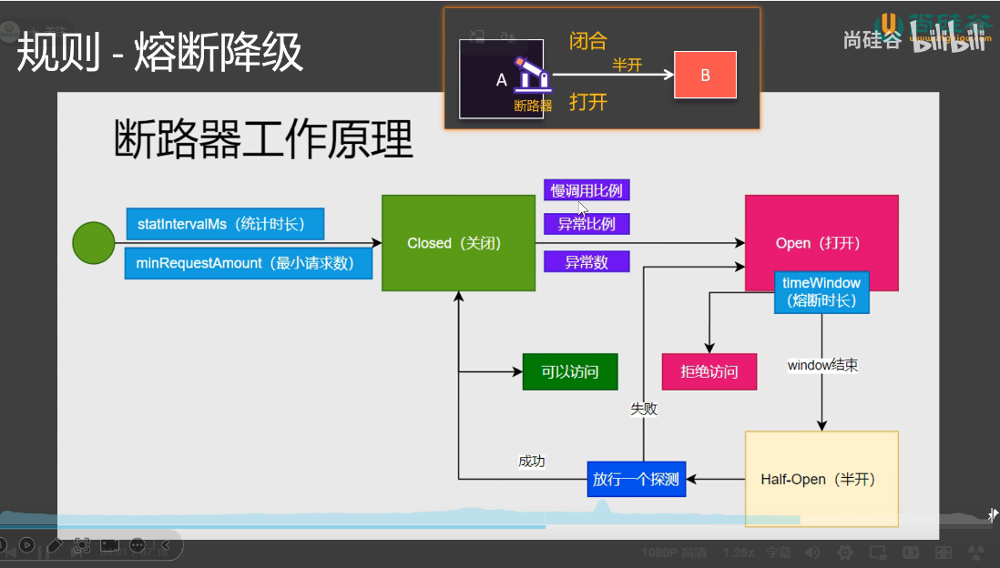
#### 三种熔断策略：
* 慢调用比例
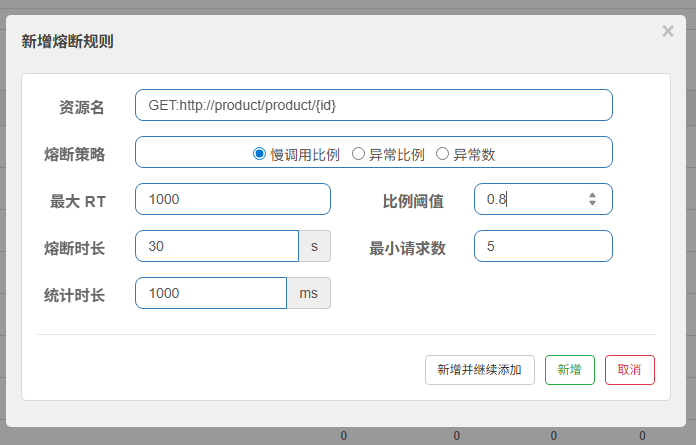
* 异常比例
* 异常数

## 热点规则

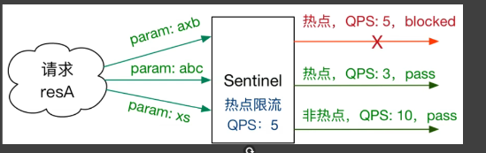

### 需求1： 每个用户秒杀QPS不得超过1（秒杀下单userId级别）
在controller中把需要控制的API 方法，上面加@SentinelResource
```java
    @PostMapping("/seckill")
    @SentinelResource(value = "seckill-order", blockHandler = "seckillBlockHandler")
    public ResponseEntity<Order> secKill(@RequestParam(name="userId", required = false) Long userId, @RequestParam(name = "productId")  Long productId) {
        System.out.println(orderProperties.getTimeout());
        return ResponseEntity.status(HttpStatus.CREATED).body(orderService.create(userId, productId));
    }

    public ResponseEntity<Order> seckillBlockHandler(Long userId, Long productId, BlockException blockException) {
        Order order = new Order();
        order.setTotalPrice(new BigDecimal("0.00"));
        order.setUserId(0L);
        order.setAddress("create seckill block handler");
        return ResponseEntity.status(HttpStatus.CREATED).body(order);
    }

```
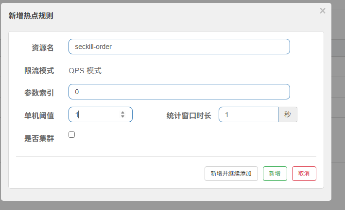
### 需求2：6号用户是vvip，不限制QPS
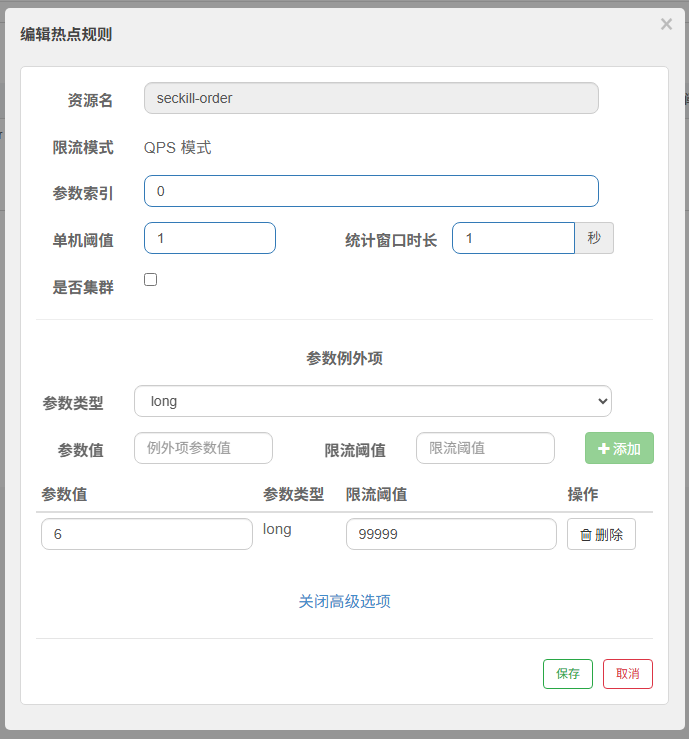

### 需求3：666号是下架商品， 不允许访问
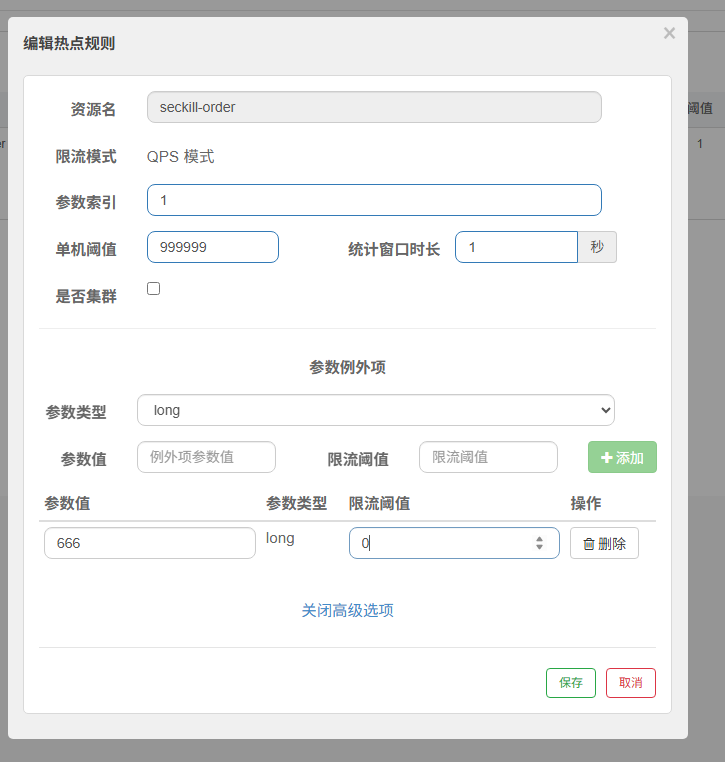

# Gateway

maven配置
```xml
    <dependencies>

        <dependency>
            <groupId>com.alibaba.cloud</groupId>
            <artifactId>spring-cloud-starter-alibaba-nacos-discovery</artifactId>
        </dependency>
        <dependency>
            <groupId>org.springframework.cloud</groupId>
            <artifactId>spring-cloud-starter-gateway-server-webflux</artifactId>
        </dependency>
        <dependency>
            <groupId>org.springframework.cloud</groupId>
            <artifactId>spring-cloud-starter-loadbalancer</artifactId>
        </dependency>
    </dependencies>
```

RouteDefinition

配置路由
```yaml
spring:
  cloud:
    gateway:
      server:
        webflux:
          routes:
            - id : order-route
              uri: lb://order
              predicates:
                - Path=/order/**

            - id: product-route
              uri: lb://product
              predicates:
                - Path=/product/**
```
还可以在每个route下加filter和order, filter会在转发给对应的service之前执行，order决定route顺序

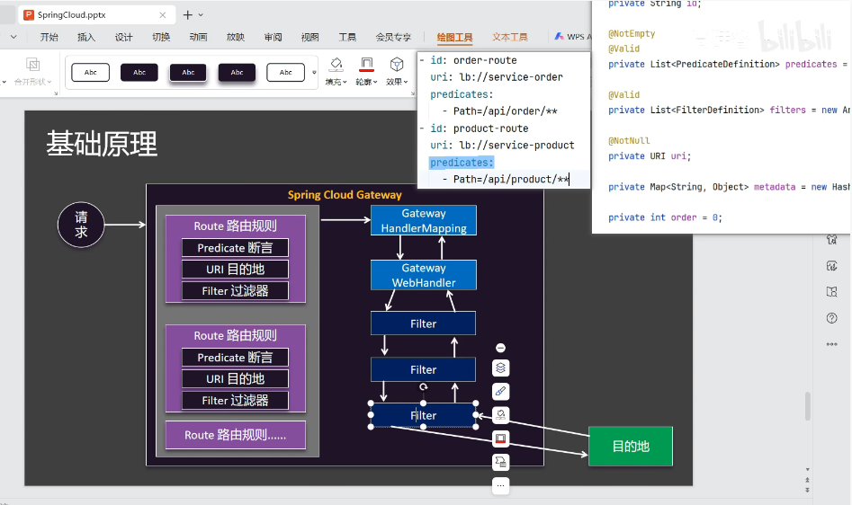

## 断言 Predicate
* RoutePredicateFactory -> 17种实现类（包括）-> 通过Config 类查看参数定义
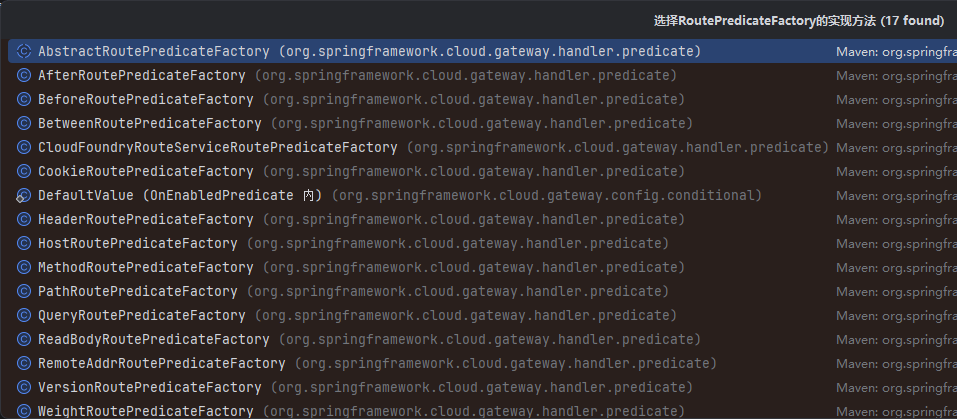

比如Header断言
```yaml
          routes:
            - id : order-route
              uri: lb://order
              predicates:
                - Path=/order/**
                - Header=X-API-Version, v2

            - id: product-route
              uri: lb://product
              predicates:
                - Path=/product/**
                - Header=X-API-Version, v1
```

自定义断言，继承AbstractRoutePredicateFactory

## Filter 过滤器

### 默认过滤器
https://docs.spring.io/spring-cloud-gateway/reference/spring-cloud-gateway-server-webflux/gatewayfilter-factories.html

例如：AddResponseHeader
```yaml
spring:
  cloud:
    gateway:
      server:
        webflux:
          routes:
            - id : order-route
              uri: lb://order
              predicates:
                - Path=/order/**
              filters:
                - AddResponseHeader=X-Response-Red, Blue


            - id: product-route
              uri: lb://product
              predicates:
                - Path=/product/**
              filters:
                - AddResponseHeader=X-Response-Red, Blue

```

结果：
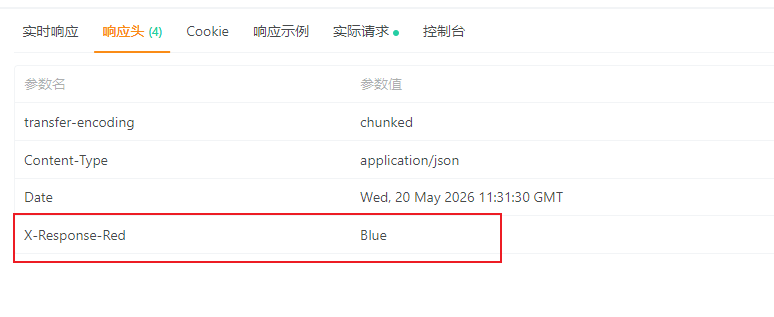

### Default 默认过滤器
以上面的filter配置为例，order-route和product-route 的filter是重复的，Spring Cloud Gateway支持全局默认过滤器，让两个route都执行，所以上面的配置也可以简化为：
```yaml
spring:
  cloud:
    gateway:
      server:
        webflux:
          default-filters:
            - AddResponseHeader=X-Response-Red, Blue
            
          routes:
            - id : order-route
              uri: lb://order
              predicates:
                - Path=/order/**

            - id: product-route
              uri: lb://product
              predicates:
                - Path=/product/**
```
从测试结果看效果是一样的

### GlobalFilter 实现Filter

```
@Slf4j
@Component
public class TimeFilter implements GlobalFilter, Ordered {
    @Override
    public Mono<Void> filter(ServerWebExchange exchange, GatewayFilterChain chain) {
        String path = exchange.getRequest().getURI().getPath();
        long start = System.currentTimeMillis();
        log.info("Request URI : {}, enter", path);

        return chain.filter(exchange).doFinally((s) -> {
            long end = System.currentTimeMillis();
            log.info("Request URI : {}, exit, totalTime: {} millisec", path, end - start);

        });
    }

    @Override
    public int getOrder() {
        return 0;
    }
}

```

### 自定义过滤器工厂

继承AbstractNameValueGatewayFilterFactory

### 跨域

### 问题
微服务之间的调用经过网关吗？看OpenFeignClient 设置的service name, 可以过 也可以不过，最好不过，比较方便


# Seata

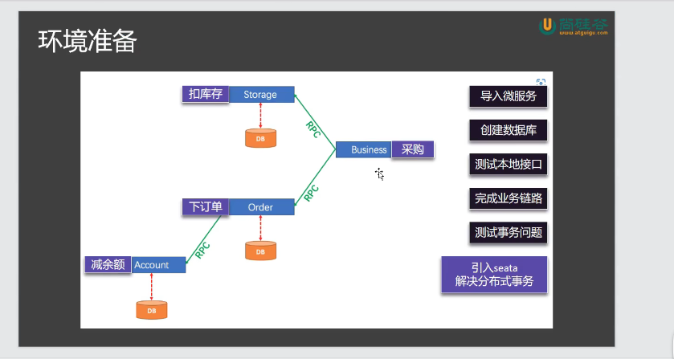

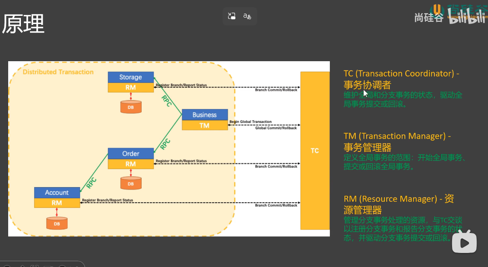
TC: 事务协调者，管理整个事务，和分事务同步状态，主要是Seata-Server
TM: 事务管理器，负责开启全局事务的，主要是主入口，通过注解@GlobalTransactional
RM：资源管理，负责管理分支事务，并于TC同步状态，具体的service

## 配置
Docker 部署Seata-server
参考官网https://seata.apache.org/zh-cn/docs/ops/deploy-by-docker

docker-compose.yml
```yaml
version: "3"
services:
  seata:
    image: apache/seata-server:2.5.0
    container_name: seata-server
    ports:
      - "8091:8091"   # 控制台端口
      - "7091:7091"   # 服务通信端口
    environment:
      - SEATA_PORT=8091
      - STORE_MODE=file  # 本地存储模式，不用数据库
    restart: always

```

配置service端的file.conf, 给客户端配置与Seata-server通信参数
file.conf
```
 service {
   #transaction service group mapping
   vgroupMapping.default_tx_group = "default"
   #only support when registry.type=file, please don't set multiple addresses
   default.grouplist = "127.0.0.1:8091"
   #degrade, current not support
   enableDegrade = false
   #disable seata
   disableGlobalTransaction = false
 }
```

在TM端（事务管理器端）开启全局事务
```java
    @GlobalTransactional
    @GetMapping("/purchase")
    public String purchase(@RequestParam("userId") String userId,
                           @RequestParam("commodityCode") String commodityCode,
                           @RequestParam("count") int orderCount){
        businessService.purchase(userId, commodityCode, orderCount);
        return "business purchase success";
    }
```

## 二阶段提交
全局事务开启，产生全局事务id
### 第一阶段，本地事务：
每个分支事务在各个service中，生成分支事务id，在更改数据之前，保存修改之前得数据作为前镜像，改完得到后镜像， 注册分支事务申请数据的记录锁，防止外界更改，本地事务提交，业务数据与undo log一起提交， 向TC汇报自己成功与否。

### 第二阶段，全局事务成功/失败
* 成功，TC通知微服务全局事务成功，微服务响应ok,异步删除undo log
* 失败，如果某个本地事务失败了，微服务会告诉TC， TC通知其他分支事务要回滚, 找到undo log, 根据后镜像的值决定当前数据只有自己被改过，大胆回滚，如果不是，要根据seata配置决定回滚策略，这一步是数据校验。

## 四种模式

### AT模式 自动提交模式，默认值，适合针对只有数据库操作的分布式事务，第一阶段会提交本地事务

### XA模式 和AT类似，但在第一阶段，并不会真正提交本地事务，一直占着事务锁，使用阻塞模式，性能比较低下

### TCC模式 手动提交，手动定义prepare，commit，rollback方法 实现TccActionOne接口，适合于夹杂了非数据库事务， 比如发送短信

### Saga模式 长事务解决方案，适合结合消息队列，适合自定义补偿代码