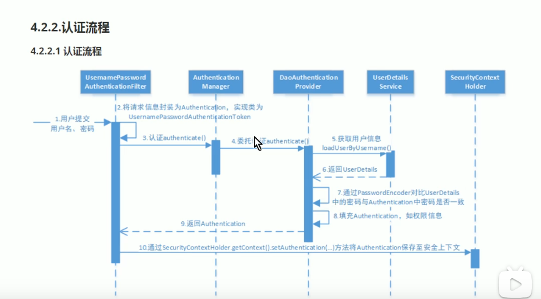
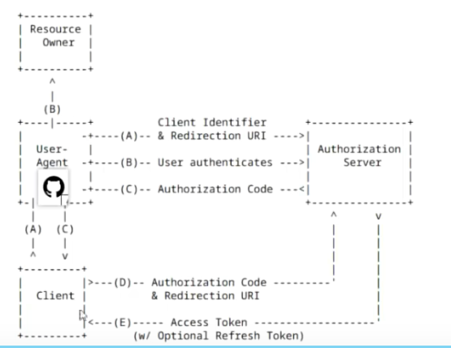

主流做法

1. 用jwt token 做认证，通过AuthenticationManager 调用UserDetailsService，使用PasswordEncoder 验证密码
2. 用redis存用户权限
3. 用spring security 做权限管理
4. 用Filter验证token及有效期
5. 通过redis获取权限 放到SecurityContextHolder中

## Oauth2.0

### 角色
1. 资源所有者（resource owner) 即用户
2. 客户应用， app或浏览器
3. 资源服务器(resource server) 存储受保护的资源，比如订单服务，商品服务， 验证token，决定是否可以访问资源
4. 授权服务器， 负责验证资源所有者，颁发token

代理授权：资源拥有者让客户应用想授权服务器授权

### 四种授权模式
https://www.ruanyifeng.com/blog/2019/04/oauth-grant-types.html

* 授权码模式 (比较常见)
客户应用先申请授权码， 再用授权码申请token

客户应用要在授权服务器注册客户应用，注册后会得到一个ClientID和ClientSecrets

* 隐藏式
客户应用直接申请token，适合只有前端的应用

* 密码式
客户应用向授权服务器申请资源拥有者的密码，客户应用用用户名密码申请token （通常是公司内部应用）

* 客户端凭证式
  与隐藏式类似，也是直接申请token
  但是这是针对客户应用的，多个用户共享一个令牌

